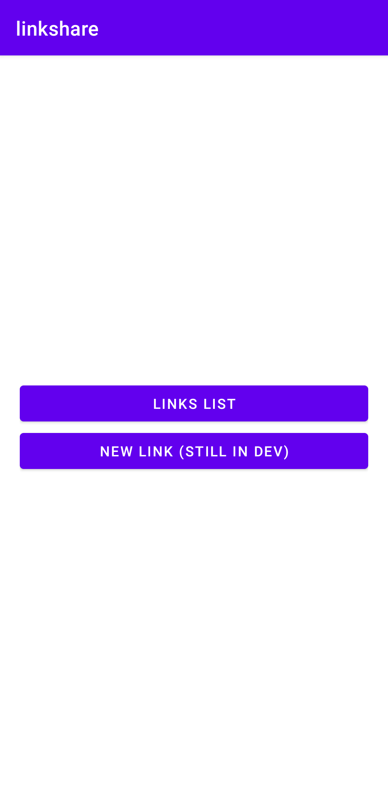
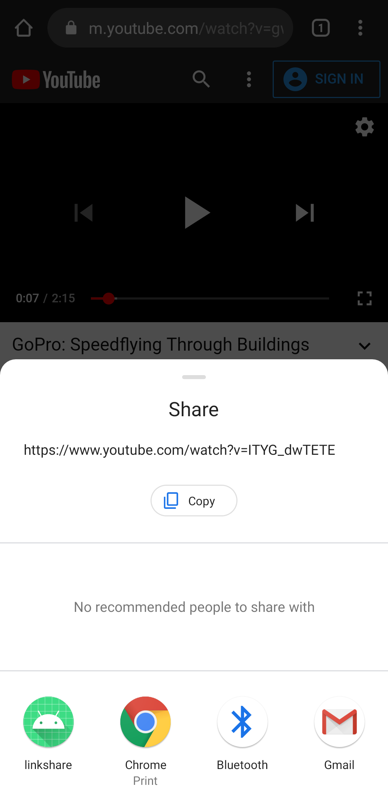
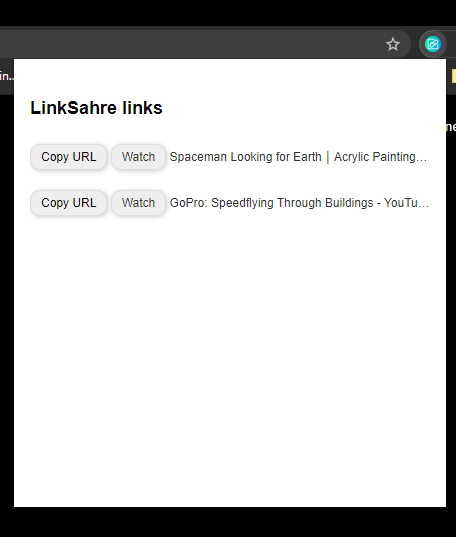

# linkshare

### This is the repo for the Opensource App LinkShare.

### The main function of this app is to have a list of interesting links that you want to save to check later or just to have them located.

### This app has the functionality to share links from the share button of your android.

### You can also download the [LinkShare Chrome Extension](https://github.com/Morcu/linkShare_ChromeExtension) to have the list of links in Chrome.

###  The App and the extension is still on development.

###  If you want to support this project or support me to keep developing opensource projects you can donate for coffee!

