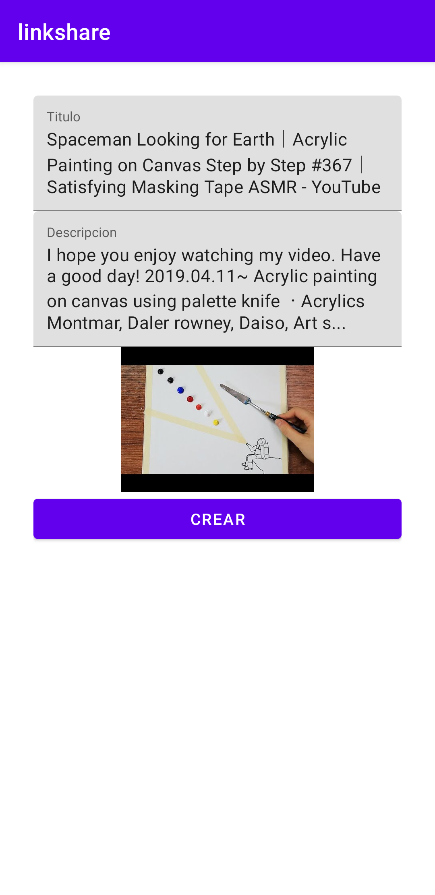

# linkshare

This is the repo for the Opensource App LinkShare.

The main function of this app is to have a list of interesting links that you want to save to check later or just to have them located.

This app has the functionality to share links from the share button of your android.

You can also download the [LinkShare Chrome Extension](https://github.com/Morcu/linkShare_ChromeExtension) to have the list of links in Chrome.

The App and the extension is still on development.